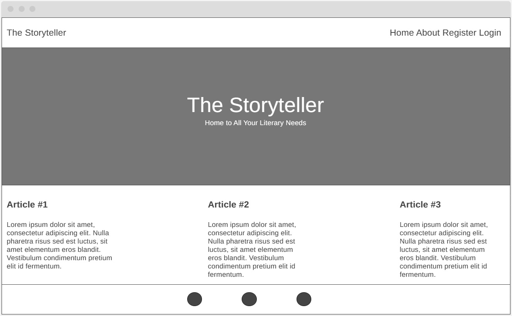
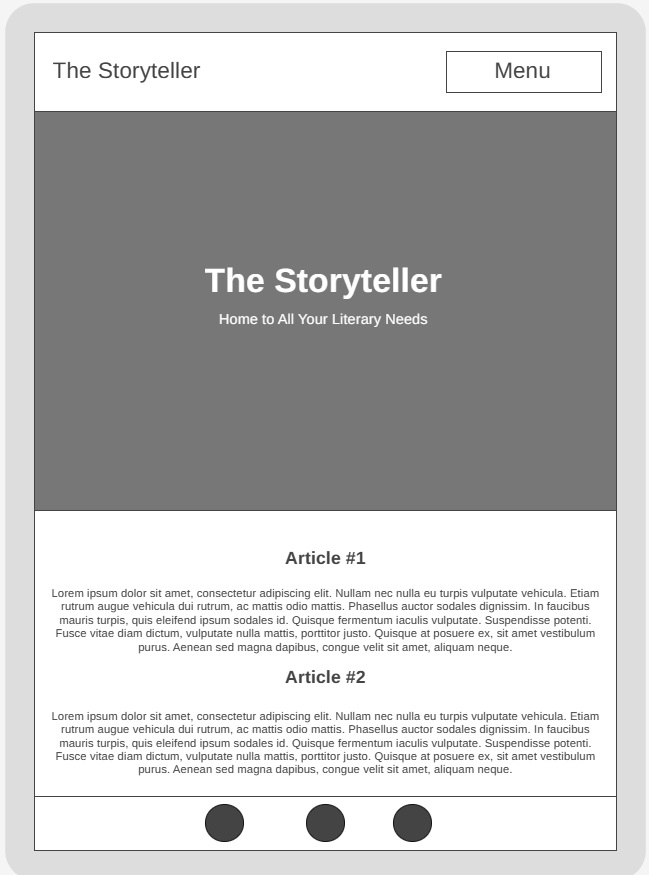

# The Storyteller
Developed by **Dorian Wolarz**, a Code Institute Student

*The Storyteller is a Full Stack website which works as a mini blog. Users can create personal accounts and afterwards they can create, share and comment on each other's short stories. In a general sense it will be a very primitive version of WordPress or WattPad.*

[LINK TO HEROKU VERSION](https://the-storyteller.herokuapp.com/)

## Contents
1. [Project Goals](#project-goals)
    - [User Goals](#user-goals)
    - [Site Owner Goals](#site-owner-goals)
2. [User Experience](#user-experience)
    - [Target Audience](#target-audience)
    - [User Requirements and Expectations](#user-requirements-and-expectations)
    - [User Stories](#user-stories)
       - [Admin Stories](#admin-stories)
       - [User Stories](#user-stories)
3. [Design](#design)
    - [Design Choices](#design-choices)
    - [Colour and Fonts](#colour-and-fonts)
    - [Structure](#structure)
    - [Wireframes](#wireframes)
4. [Features](#features)
5. [Technologies Used](#technologies-used)
    - [Languages](#languages)
    - [Tools and Websites](#tools-and-websites)
6. [Testing and Validation](#testing-and-validation)
    - [HTML Validation](#html-validation)
    - [CSS Validation](#css-validation)
    - [Python Validation](#python-validation)
    - [Accessibility](#accessibility)
    - [Performance](#performance)
    - [Manual Testing of Admin and User Stories](#manual-testing-of-admin-and-user-stories)
7. [Known Bugs](#known-bugs)
8. [Deployment](#deployment)
9. [Credits](#credits)
    - [Code and Assets](#code-and-assets)
    - [Media](#media)

## Project Goals

### User Goals

* Easily navigate across a clean user interface.
* Read highly engaging short stories.
* Like existing stories.
* Comment on existing stories.

### Site Owner Goals

* Facilitate the existence of a creative environment where authors can share stories with readers.
* Promote user engagement by allowing users to like and comment on stories.
* Promote creativity by reaching out to up and coming writers of various genres.

## User Experience

### Target Audience

* Authors of short stories and fanfictions wanting to publish their work and have it received by readers.
* Readers who want to read short stories and engage with the material by liking and commenting.

### User Requirements and Expectations

* A well structured, user-friendly and efficient webpage.
* Simple and intuitive navigation system.
* A glitchless experience with features that work properly.
* An interactive environment where users can rate short stories and leave comments.
* A level of accessibility for students and new users with disabilities.

### User Stories

For the purpose of this project I have created a list of fitting user and admin stories to serve as a design guide in creating this webpage. *The Storyteller* is a mini blog webpage for sharing short stories and, as such, I based it on the Code Institute project of *I Think Therefore I Blog* given the similar theme. I've come up with the following user and admin stories thus far:

#### Admin Stories

* As a **site admin** I can **create, read, update and delete posts** so that **I can manage the content of the entire website**.
* As a **site admin** I can **create drafts** so that **I can finish creating the content at a later stage**.
* As a **site admin** I can **approve or deny user comments** so that **I can filter out objectionable comments**.

#### User Stories

* As a **site user** I can **register for a new account** so that **I can use the website's full functionality**.
* As a **site user** I can **log in to my account**.
* As a **site user** I can **log out of my account**.
* As a **site user** I can **click on a post** so that **I can read the full text**.
* As a **site user** I can **like or unlike** a post so that **I can interact with the content other users have created**.
* As a **site user** I can **view the comments under a post** so that **I can read the feedback other users have shared**.
* As a **site user** I can **comment under a post** so that **I can share my own feedback under other users' content**.
* As a **site user** I can **view a paginated list of blog posts** so that **I can easily select a post I want to view**.
* As a **site user** I can **view a list of blog posts** so that **I can view a post**.
* As a **site user** I can **view the number of likes on each post** so that **I can see which short stories people enjoy the most**.

## Design

### Design Choices

N/A

### Colour and Fonts

N/A

### Structure

The website is structured in a user friendly way that makes navigation of its contents extremely easy and makes it pleasing to the eye. The *Home Page* serves as the central hub of the design, allowing for quick access to other sections of the project through fully interactive buttons. More details on the project and its aims are stored in the *About* page. The users can *Register*, *Login* and *Logout*. Each article and short story is stored in a separate page. As such, the website consists of de facto six separate pages:
* **The Home Page**, with its selection of buttons and a collapsible menu for mobile users.
* **About Page**, with its short writeup on the project and its goals.
* **Register Page**, with its easy-to-use registration system for new users.
* **Login Page**, with its username and password login options for existing users.
* **Logout Page**, with its easy-to-use logout option for logged in, existing users.
* **Article Page**, which displays each article and short story in a separate view.

### Wireframes

  
Personal Computer View

  

  
Mobile View

  

## Features

N/A

## Technologies Used

### Languages

* HTML 5
* CSS 3
* Python 3

### Tools and Websites

* Git *for version control*
* GitHub *to store code and deploy the website*
* GitPod *as an IDE to build the project and edit the code*
* Django *as framework to develop the project*
* Heroku *to deploy the project and host it*
* Bootstrap *to access HTML design templates*
* Crispy Forms *to access and display premade forms on the website*
* Fontawesome *to access free icons*
* GoogleFonts *to access different font styles*
* Django Summernote *for visualization of post creation and edits*
* W3C *to validate HTML and CSS code*
* CI Python Linter *to validate Python code*

## Testing and Validation

### HTML Validation

N/A

### CSS Validation

N/A

### Python Validation

N/A

### Accessibility

N/A

### Performance

N/A

### Manual Testing of Admin and User Stories

WIP

## Known Bugs

N/A

## Deployment

### GitHub

This project was deployed using *Code Institute's Python Template* on GitHub.

You can *deploy the repository* on GitHub by following these steps:

1. In your GitHub repository navigate to the *Settings* tab
2. In the menu on the left hand side select *Pages*
3. For the source of your repo select *branch: main*
4. After the webpage refreshes, you will see a ribbon on the top saying: *"Your site is published at https://ravopl.github.io/the-storyteller/"*

You can *fork the repository* by following these steps:

1. Go to the GitHub repository
2. Click on Fork button in upper right hand corner

You can *clone the repository* by following these steps:

1. Go to the GitHub repository
2. Locate the Code button above the list of files and click on it
3. Select if you prefer to clone using HTTPS, SSH or GitHub CLI and click the copy button to copy the URL to your clipboard
4. Open GitBash
5. Change the current directory to the one you previously cloned
6. Type git clone and paste the URL from the clipboard ($ git clone https://github.com/YOUR-USERNAME/YOUR-REPOSITORY)
7. Press 'Enter' to create your local clone

### Heroku

This project was deployed using *Code Institute's Python Terminal* on Heroku.

After the repository is forked, you can deploy it by following these steps:

1. Create an account on Heroku or log into your existing one
2. Go to the *Dashboard*
3. Create a new app, add its name and your geographical region
4. Click on *Create App*
5. Go to your *Settings* tab
6. Under *Config Vars*, add **PORT** for key and **8000** for value
7. Click *Add*
8. Click *Add Buildpack*
9. Add **python** from the list and press *Save Changes*
10. Add **nodejs** from the list and press *Save Changes*
11. Ensure that python is placed **above** nodejs
12. Scroll up and click *Deploy*
13. Navigate to *Deployment Method* and click on *GitHub*
14. Confirm that you want to *Connect to GitHub* and link your account
15. Search for the GitHub repository you had previously forked
16. Click *Connect*
17. Scroll down and click on *Deploy Branch*

## Credits

### Code and Assets

* *Code Institute* for the CI Full template on GitHub
* *Code Institute* for the deployment terminal on Heroku
* *Code Institute* for *I Think Therefore I Blog*
* [Basic Bootstrap Template (EDITED BY ME): *Clean Blog* by Start Bootstrap](https://startbootstrap.com/theme/clean-blog)
* [About Us Bootstrap Template (EDITED BY ME): *Bootstrap 5 About Us Page Section* by Bootstrap Brain](https://bootstrapbrain.com/component/bootstrap-about-us-page-section/)
* [TUTORIAL: *Django Recipes Full Stack App* by Dom Vacchiano](https://www.youtube.com/watch?v=w7EJu9Gd5Ns&list=PLQbt1tI_yQHg5HYpdUqit1wkc4BOPTkpx)

### Media

* [Typewriter Image by *American Farmhouse Style*](https://americanfarmhousestyle.com/wp-content/uploads/2021/10/IMG_1252.jpg)